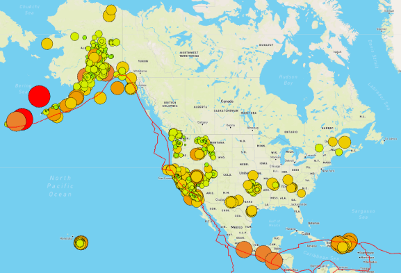
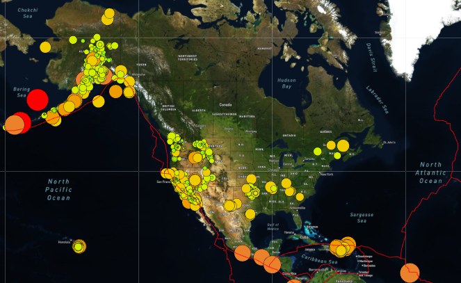
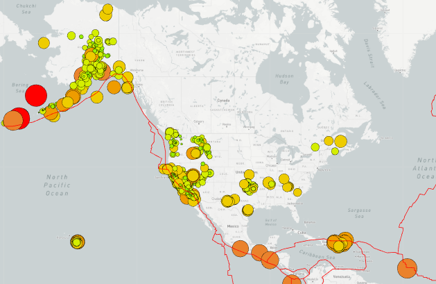

# Mapping earthquakes around the world using Javascript, APIs, D3, and Leaflet library

## Overview

The purpose of this project was to create an interactive visualization of Earthquake data using the d3 library to make API calls to retrieve the most
recent data on earthquakes which have occurred throughout the world in the past 7 days. The data was retrieved from [USGS.GOV](https://earthquake.usgs.gov/earthquakes/feed/v1.0/summary/all_week.geojson) which is in GeoJSON format. The data was read in and then code was written to create the maps, using [Mapbox](https://www.mapbox.com/). Each earthquake was mapped and formatted based on its magnitude. Different colors and marker sizes were used, as determined by the magnitude. The tectonic plate data was retrieved from [Github](https://raw.githubusercontent.com/fraxen/tectonicplates/master/GeoJSON/PB2002_boundaries.json).

## Tile Layers and Overlays

Three different Mapbox styles were used which can be toggled on and off (Streets, Satellite, and Light). This was completed by creating a tile layer for each style and then adding
the tile layer to the baselayer. Only one style can be used at a time. 

### Each Style

*An image of the Streets style is displayed under the "Overview" section above*

#### Satellite

#### Light

### Overlays

There are three different overlay options: Earthquakes (which is all earthquakes regardless of magnitude), Tectonic Plates, and Major Earthquakes (Earthquakes w/ magnitude over 4.5). 
There can be any combination of active overlays at any given time. All can be displayed simultaneously, one at a time, or multiple. This is made apparent by the check boxes next to each label. In the above images, all overlays are active. Please see below image of only the major earthquake overlay. 

